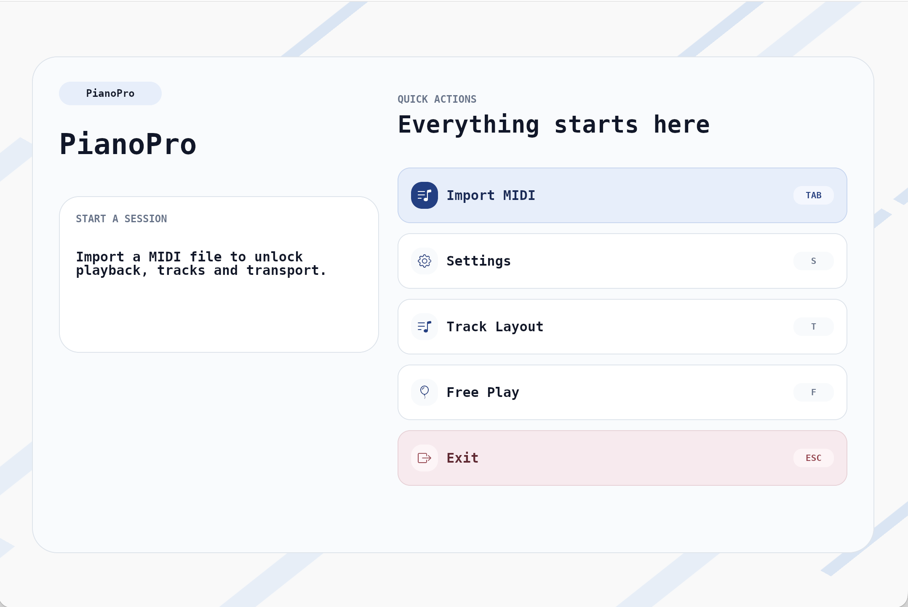
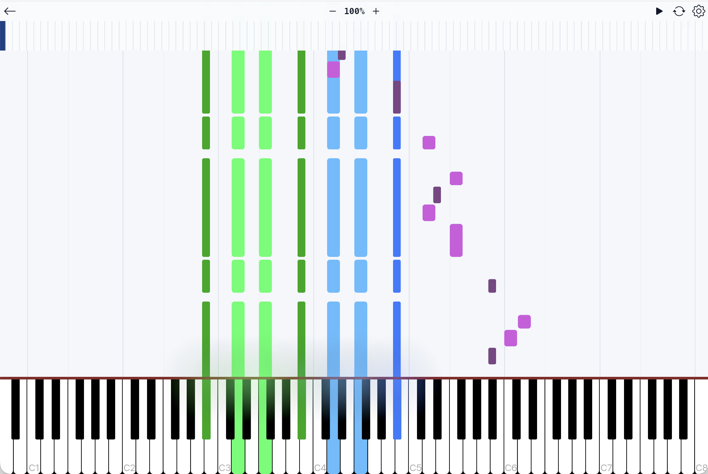

# PianoPro

PianoPro is a professional piano learning and MIDI visualization tool, inspired by Guitar Pro but designed specifically for piano.

It extends [Neothesia](https://github.com/PolyMeilex/Neothesia), a great open-source MIDI visualizer written in Rust, with the features that serious learners actually need: sheet music display, auto-transcription, structured practice tools, and more.

The goal is a focused, no-nonsense workspace for piano practice and analysis — something closer to what Guitar Pro is for guitarists.

## What this version adds

Neothesia is GPU-accelerated, fast, and clean. This fork keeps all of that and builds the learning layer on top:

| | Neothesia | PianoPro |
|---|---|---|
| MIDI playback & visualization | ✅ | ✅ |
| Track mute / visibility in playback | ❌ | ✅ |
| Always-visible transport bar | ❌ | ✅ |
| Play confirmation dialog | ❌ | ✅ |
| Sheet music display | ❌ | 🚧 Planned |
| Audio → MIDI transcription | ❌ | 🚧 Planned |
| Hands-separate practice mode | ❌ | 🚧 Planned |
| Loop section (A/B repeat) | Partial | 🚧 Improving |
| Performance scoring | ❌ | 🚧 Planned |
| Fingering suggestions | ❌ | 🚧 Planned |

## Current Features

- MIDI file import and playback with synchronized piano visualization
- Per-track controls during playback (mute, auto, human-play modes)
- Track visibility toggle — hides notes from both waterfall and keyboard
- Transport bar always visible: speed control, progress scrubbing, loop markers
- Countdown before playback starts
- Play-along mode with required key detection
- Light-mode UI designed for extended practice sessions

## Roadmap

Features planned or in progress, roughly by priority:

**Sheet music**
- Standard notation display synchronized with MIDI playback
- Scrolling score that follows the current position
- Chord symbol overlay
- Fingering number annotations

**Auto-transcription**
- Audio file → MIDI conversion (record yourself playing, get a MIDI back)
- Microphone input for real-time note detection and feedback
- Chord recognition from audio

**Practice tools**
- Hands-separate mode (left hand / right hand isolation)
- Fine-grained loop control with visual A/B markers
- Practice tempo ramp (auto-increase speed as you hit targets)
- Configurable lead-in and countdown

**Analysis & feedback**
- Performance scoring: timing accuracy, missed notes, early/late statistics
- Session history and progress tracking over time
- Difficulty estimation per section

**Other**
- Fingering suggestion engine
- Metronome with subdivisions
- Export performance replay as video
- Custom color themes per track

## Screenshots

<p align="center">
  
  
</p>

## Building

```bash
# Run the app
cargo run --release --bin neothesia

# Build
cargo build --release --bin neothesia
```

Requires a `default.sf2` soundfont in the project root or a system-installed one for audio playback.

## Credits

Based on [Neothesia](https://github.com/PolyMeilex/Neothesia) by PolyMeilex — a GPU-accelerated MIDI visualizer written in Rust.

## License

GNU GPL v3 — same as the original Neothesia project.
